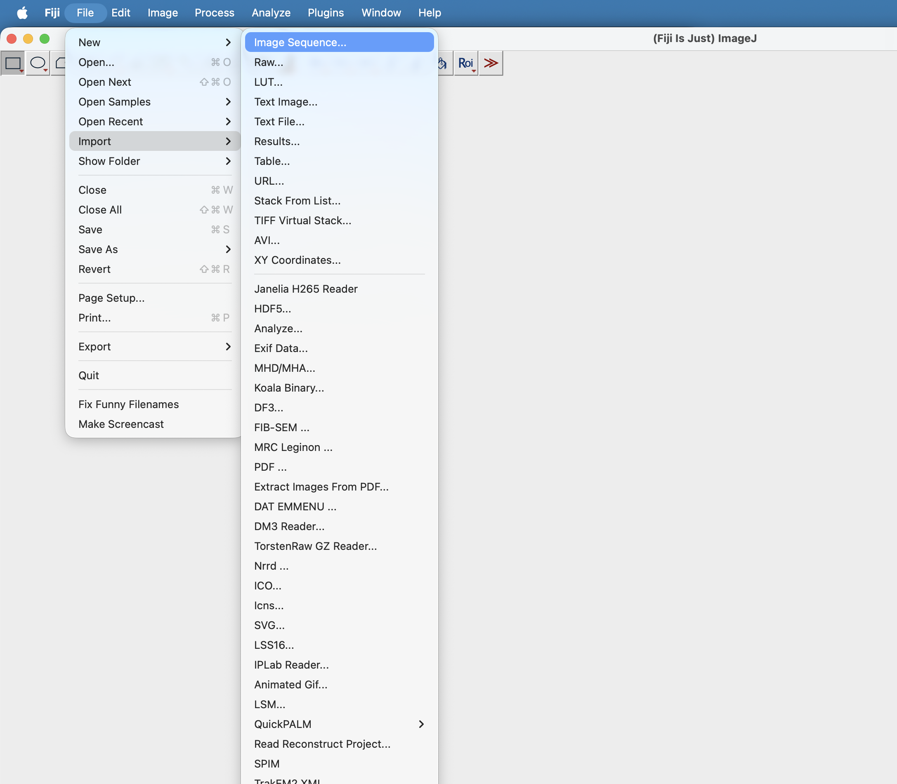

# Dust Dynamics Analysis

Tools for **automated TrackMate analysis in Fiji** and for **post-processing dust-particle trajectories in Python**.

This repository supports the full workflow used in the dust lofting experiments: starting from image sequences exported from high-speed camera data, running automated particle tracking in Fiji/TrackMate, and then filtering, analysing, and plotting the reconstructed trajectories in Python.

## Repository Structure

- `fiji_automation/`  
  Scripts for automated TrackMate execution in Fiji.
  - `automate_trackmate.py` — Fiji/Jython script executed in headless mode for a selected frame range
  - `run_automated_trackmate.py` — Python launcher that splits image sequences into frame windows and runs Fiji automatically

- `track_mate_visualisation/`  
  Python package for loading, filtering, analysing, and plotting TrackMate outputs.

## Fiji and TrackMate

Fiji can be downloaded from:  
<https://imagej.net/software/fiji/downloads>

TrackMate needs to be installed as an additional plugin:  
<https://imagej.net/plugins/trackmate/>

### Recommended manual setup workflow

Before running the automated analysis, it is useful to determine suitable TrackMate settings manually:

1. Import the image sequence (`.tif` files) into Fiji 
2. Start the TrackMate plugin
3. Choose a spot detection algorithm
4. Test different values for spot size, prominence, and quality thresholds  
   (Best performance in my case: **DoG detector**)
5. Test different linking algorithms depending on the observed motion  
     (Best performance in my case: **Kalman linker**)
6. Once good settings are found, use them in the automated workflow to process larger image sequences consistently

## Automated TrackMate Workflow

### 1. Prepare the Image Sequence

The Fiji automation expects an image-sequence directory containing files named like:

- `out_0001.tif`
- `out_0002.tif`
- `out_0003.tif`

More generally, any integer suffix is supported as long as the filename pattern is:

```text
out_<number>.tif

### 2) Run the batch launcher

From the repository root:

```bash
python fiji_automation/run_automated_trackmate.py \
  --fiji "/path/to/Fiji.app/Contents/MacOS/fiji-macosx" \
  --script "/path/to/repo/fiji_automation/automate_trackmate.py" \
  --input-root "/path/to/experiment_root" \
  --sequence-subdir tifs \
  --output-subdir results \
  --step 2000 \
  --xmx 18g \
  --radius 6.0 \
  --quality-thresh 271.79 \
  --link-dist 45.0 \
  --gap-dist 45.0 \
  --max-frame-gap 2
```

### 3) Outputs

For each processed frame window, the Fiji script exports:

- `spots_<start>_to_<end>.csv`
- `edges_<start>_to_<end>.csv`
- `tracks_<start>_to_<end>.csv`
- `run_<start>_to_<end>.log`

inside each experiment's output directory.

## Notes

- The batch launcher now uses explicit CLI arguments instead of hard-coded machine-specific paths.
- Use `--dry-run` to inspect generated commands without executing Fiji.
- Use `--strict` to fail fast if any experiment directory fails.


